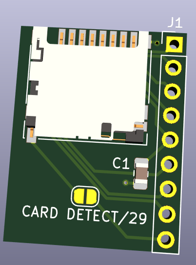

A companion breakout board with microSD connector to mate with the [Teensy 4 Header Breakout Board](https://github.com/blackketter/teensy4_header_breakout).  It's designed to solder to the top 9 pins on the left side of the header breakout.  The 9th pin provides an optional card detect (short the solder bridge) on digital pin 29.

Designed in KiCad.

Notes:

- In progress: Will be ordered soon.
- With longer header pins you should be able to flip the board to be under or over the Teensy 4.0

Left Side Pinout:

1. 34/SD DAT1
2. 35/SD DAT0
3. GND
4. 36/SD CLK
5. 3.3V
6. 37/SD CMD
7. 38/SD DAT3
8. 39/SD DAT2
9. 29
